# Workshop sobre Watson Visual Recognition - Implemente un tasador de choques que reconozca las partes dañadas de un vehículo

<p align="center">
  
</p>

## Flujo
* Crear una instancia del servicio en IBM Cloud.
* Crear las ocho clases para este ejemplo, cargando las imágenes correspondientes descargadas previamente.
* Entrenar el modelo.
* Testear el modelo.
* Utilizando Node.js o Java pruebe la API del servicio para obtener los objetos dañados de la imagen seleccionada.

## Resumen

Actualmente la inteligencia artificial es una de las áreas que más interesa en la comunidad científica y en concreto, el campo del análisis de imágenes tiene un interés especial, ya que sus aplicaciones son muy variadas y útiles.\
Uno de los casos más utilizados de análisis de imágenes es el de los clasificadores. Estos permiten identificar qué tipo de objeto se encuentra en la imagen que queremos analizar. En el ejemplo que realizaremos en este workshop, crearemos un clasificador multiclase para reconocer partes dañadas de un vehículo en una imagen.

## Descripción

En este workshop crearemos un tasador de choques que reconocerá cuáles son las partes dañadas de un vehículo a partir de una imagen. Para esto, será necesario crear un clasificador multiclase en el servicio Watson Visual Recognition que determine la probabilidad con la que una parte dañada aparece en la imagen deseada. Luego, integraremos el modelo creado con un código en Node.js o Java, según cual su interés, que, utilizando el SDK de para Watson, consuma la instancia del servicio de Visual Recognition que se ha creado. Este código imprimirá las diferentes partes dañadas que encuentra en la imagen con sus respectivas probabilidades.

## ¿Qué tiene el repositorio?
- Código
  - Imágenes_vehículos_dañados
    - Entrenamiento
    - Test
  - Java
    - SDK de Watson para Java (.jar)
    - Main.java
  - Node
    - tasador.js
- Imágenes
- README.md

## Prerrequisitos
* Registrarse en IBM Cloud: [https://cloud.ibm.com/registration](https://cloud.ibm.com/registration)
* Instalar Git
  - [Windows](https://gitforwindows.org/)
  - Linux
    ```
    $ sudo apt update 
    $ sudo apt install git
    $ git --version
    ```
  - [MacOS](https://git-scm.com/download/mac)

* Clonar el repositorio
  ```
  $ git clone https://github.com/IBMInnovationLabUY/tasador-choques-code-day
  ```

Seleccione la opción que le interesa para realizar el workshop:
* Instalar [Node.js](https://nodejs.org/es/download/)
* Instalar [Java](https://docs.oracle.com/cd/E19182-01/820-7851/inst_cli_jdk_javahome_t/)

Según la opción anterior:
* Para Node.js
  - Instalar [Visual Studio Code](https://code.visualstudio.com/download)
  - Dirigirse al directorio _Código/Node_ y ejecutar el comando ``` npm install ```
* Para Java
  - Instalar [Eclipse](https://www.eclipse.org/downloads/packages/installer)
  - Abrir Eclipse
  - Cuando se nos pide definir el workspace en el que trabajaremos, creamos uno dentro de la carpeta _Código_
  - Copiamos el SDK de Watson (.jar) que se encuentra en _Código/Java_ y lo pegamos en la raíz del workspace
  - En Eclipse, agregar el .jar al proyecto:
    - Botón derecho sobre la carpeta del proyecto
    - Abrir pestaña Build Path y seleccionar opción Add External Archives
    - Seleccionar el .jar que guardamos anteriormente en la raíz del workspace
  - En el package src, crear una clase:
    - Nombre paquete: main_package
    - Nombre clase: Main
  - Copiamos el archivo Main.java que se encuentra en _Código/Java_ y lo pegamos en _main_package_, sustituyendo la clase Main que creamos en Eclipse anteriormente

## Arquitectura

<p align="center">
  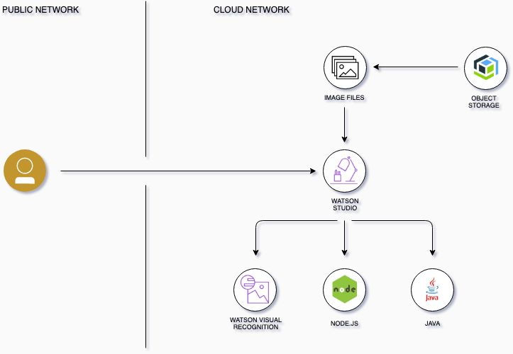
</p>

## Utilizando Watson Visual Recognition y creando el modelo clasificador multiclase

Ir al catálogo de IBM Cloud, y seleccionar **AI**.

<p align="center">
  
</p>

En las opciones que aparecen seleccionamos Watson Visual Recognition.

<p align="center">
  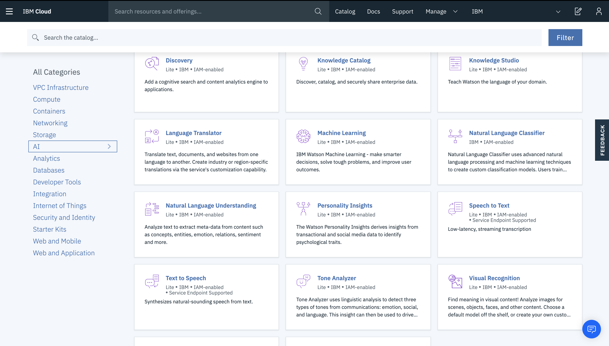
</p>

Asignamos un nombre a criterio del usuario y pulsamos en crear.

<p align="center">
  
</p>

Si vamos a la pestaña **Manage**, encontramos las credenciales del servicio recién creado. Estas serán utilizadas más adelante, cuando llamemos este servicio mediante la API que expone. Para iniciar el servicio haremos click en **Create a custom Model**.

<p align="center">
  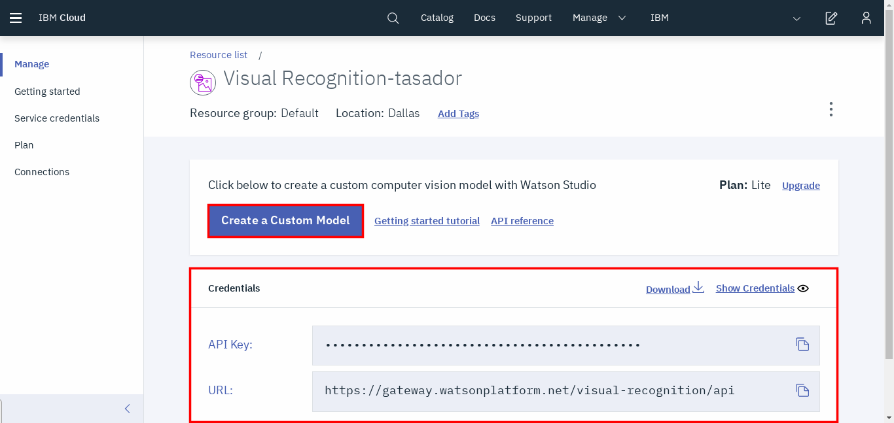
</p>

La acción anterior nos enviará a Watson Studio.

<p align="center">
  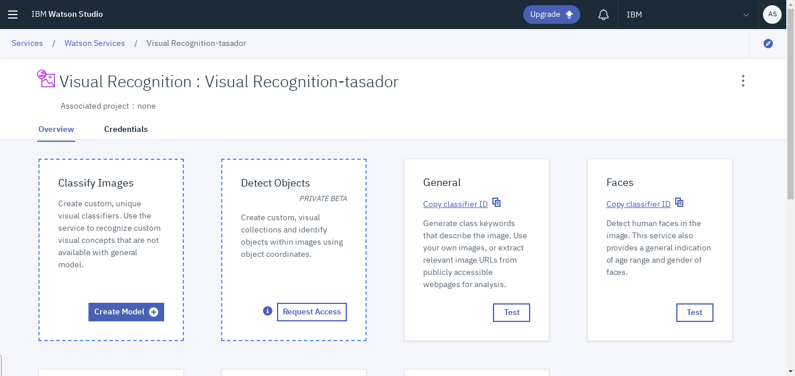
</p>

Una vez allí, se pueden observar las diferentes opciones que nos brinda el servicio para modelar distintas necesidades. Para el propósito de este workshop elegiremos la opción **Classify Images** y crearemos un modelo de ese estilo.

<p align="center">
  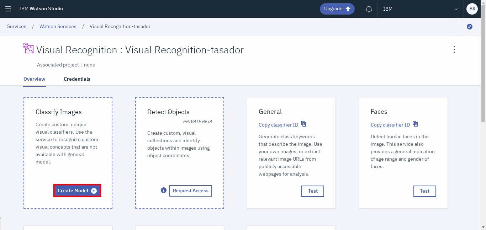
</p>

Como prerrequisito se nos pedirá que creemos un proyecto en Watson Studio para albergar al modelo que estamos por crear.\
Como nombre le asignaremos "workshop_visual_recognition" y lo creamos.

<p align="center">
  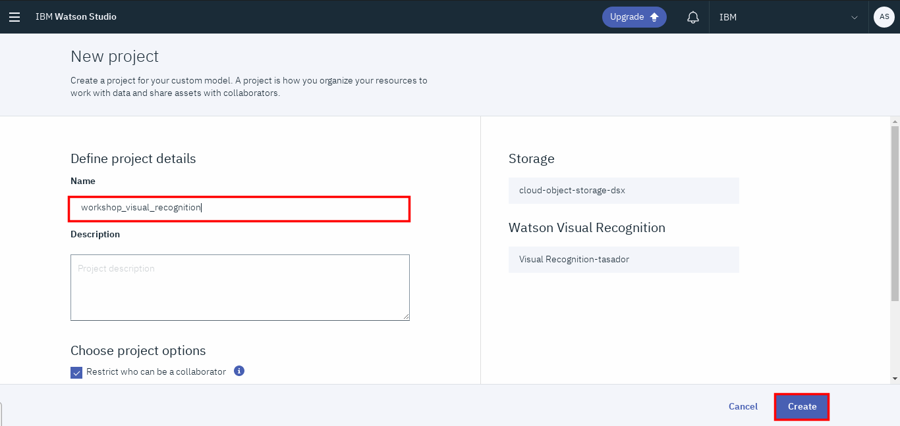
</p>

En este punto estamos creando nuestro modelo con el que clasificaremos las imágenes. Para completar este paso será necesario asignarle un nombre. Para mantener un orden en el trabajo llamaremos a este modelo "tasador_modelo".

<p align="center">
  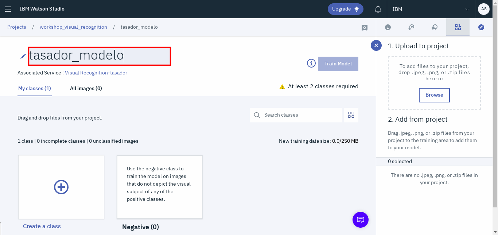
</p>

Una vez que le pusimos nombre a nuestro modelo, es hora de crear las clases. Como mencionamos previamente, estas clases serán con las que nuestro modelo clasifique. En este caso, armaremos un modelo con siete tipos de daños posibles en un auto, más una clase de neumáticos sanos, lo que se trasladará a ocho clases en el modelo. Estas clases son:
* Espejo roto
* Faros rotos
* Neumáticos pinchados
* Neumáticos sanos
* Paragolpes roto
* Puerta chocada
* Vidrio lateral roto
* Vidrio frontal roto

Para poder crear nuestras clases cargaremos los conjuntos de datos que utilizaremos. Las imágenes de entrenamiento se encuentran en el directorio _Código/Imágenes_vehículos_dañados/Entrenamiento_. Simplemente presionamos el botón **Browse** y seleccionamos los .zip que se encuentran dentro del directorio.

<p align="center">
  
</p>

Una vez que cargamos los archivos correspondientes debemos crear las clases y asignar los datos a las mismas.
Crearemos una clase y le pondremos como nombre "espejo_roto".

<p align="center">
  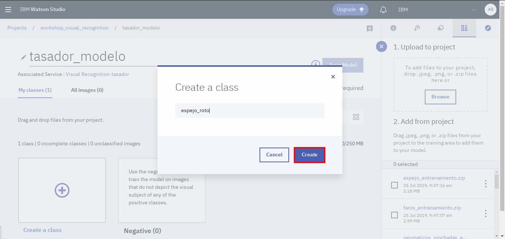
</p>

Luego, arrastramos el archivo que contiene los ejemplos con espejos rotos a la clase que acabamos de crear.

<p align="center">
  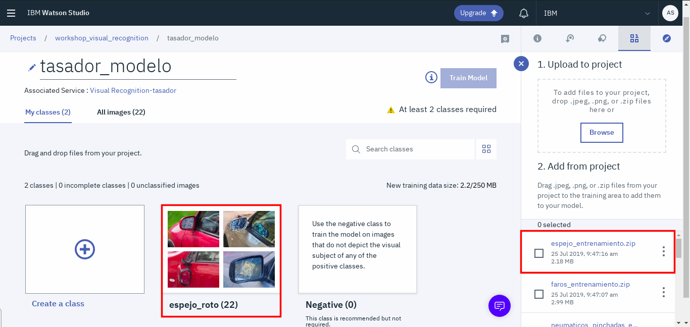
</p>

Esto lo repetiremos para las siete clases restantes.

Para poder entrenar nuestro modelo, resta agregar a la clase de Negativos imágenes de vehículos sanos. Esto se hace para mejorar el modelo y que este entienda que un auto sano no tendría que pertenecer a ninguna de las clases de nuestro modelo.

<p align="center">
  
</p>

Arrastramos el .zip que contiene las imágenes de vehículos sanos a la clase Negativos.

<p align="center">
  
</p>

En este punto, ya estamos listos para entrenar nuestro modelo. Para ello clickeamos en **Train Model** y esperamos a que culmine el entrenamiento, este proceso puede demorar unos minutos.

<p align="center">
  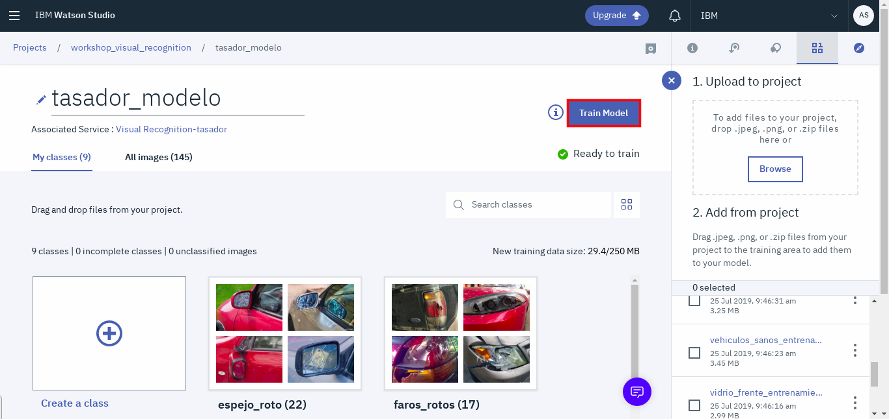
</p>

Una vez que culminó la etapa de entrenamiento, es hora de probar nuestro modelo. Hacemos click en el link **here**.

<p align="center">
  
</p>

Nos encontramos con información general acerca del modelo. Para comenzar a probarlo debemos ir a la sección **Test**.

<p align="center">
  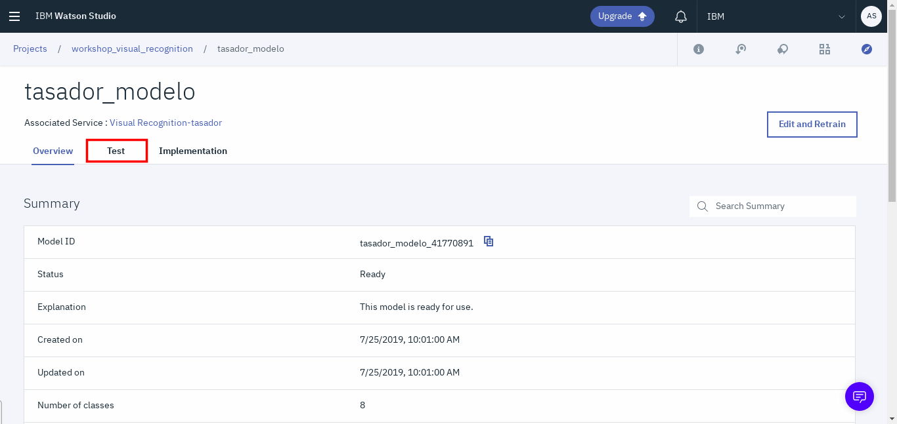
</p>

Una vez allí, simplemente seleccionamos **browse** y cargamos las imágenes que se encuentran en _Código/Imágenes_vehículos_dañados/Test_.

<p align="center">
  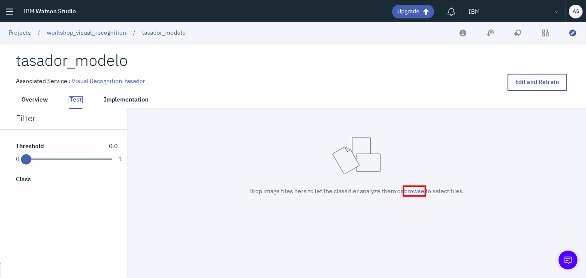
</p>

Se cargarán los resultados y podremos ver las predicciones del modelo.

<p align="center">
  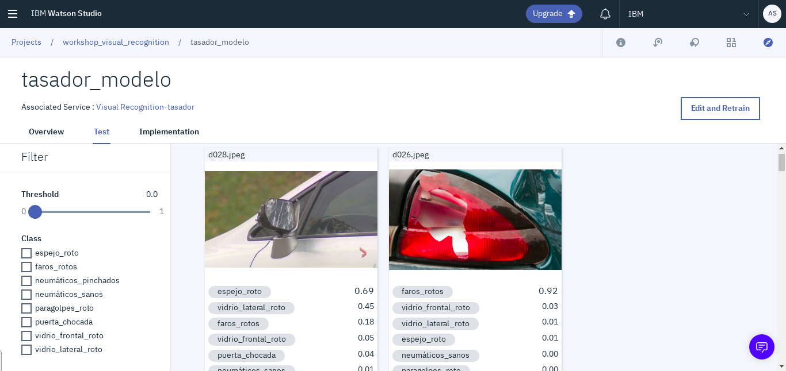
</p>

## Integrando el código con nuestro modelo

Para poder integrar nuestro código con el modelo recién creado, debemos proveer las credenciales correspondientes a nuestra instancia del servicio.\
Debemos dirigirnos a la página principal de IBM Cloud y seleccionar la lista de servicios que tenemos instanciados en la cuenta. 

<p align="center">
  
</p>

Una vez que vemos desplegada la lista de servicios activos, seleccionamos el de Visual Recognition que creamos previamente.

<p align="center">
  
</p>

Después que ingresar a la interfaz de nuestra instancia, veremos las credenciales de la misma. Copiamos la api-key y la guardamos para utilizar a continuación.

<p align="center">
  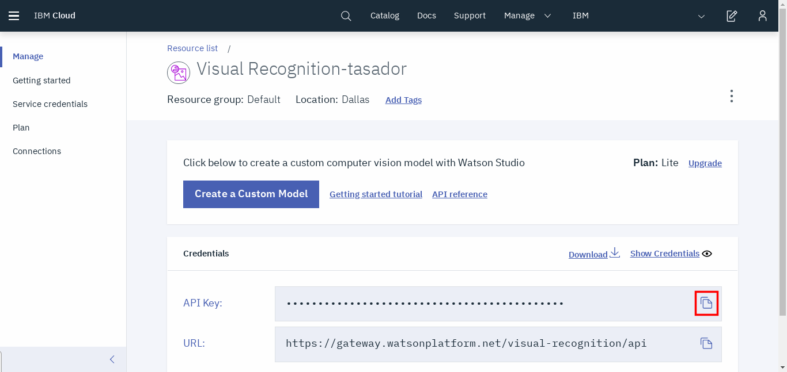
</p>

Ahora debemos obtener el identificador del modelo que creamos anteriormente. Para esto, debemos clickear en **Create a Custom Model** en la pantalla donde obtuvimos la api-key.

<p align="center">
  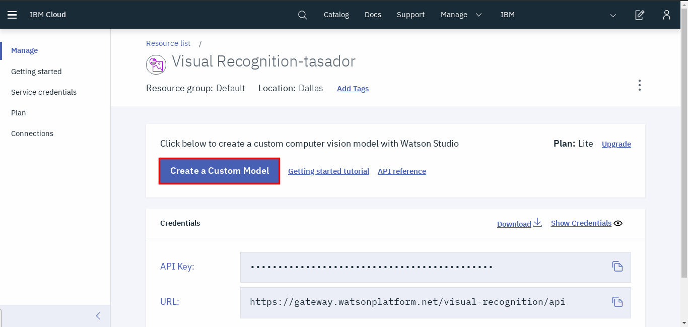
</p>

Luego hay que ir al proyecto en el que se encuentra nuestro modelo. Nos dirigimos al link que se encuentra debajo del nombre de la instancia del servicio y hacemos click sobre este. El link representa el proyecto que esta asociado a la instancia.

<p align="center">
  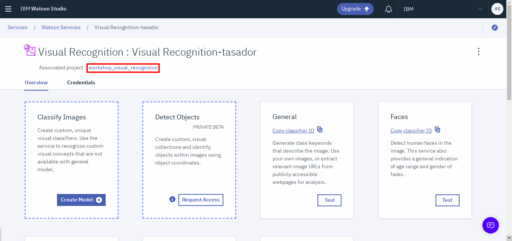
</p>

Se abrirá un ventana y pulsamos la pestaña **Assets**. Esta nos llevará a todos los recursos que se encuentran en nuestro proyecto. 

<p align="center">
  
</p>

En la parte de Modelos, buscamos el modelo que hemos creado y guardamos el campo _MODEL ID_, ya que al igual que la api-key, lo vamos a utilizar más adelante.

<p align="center">
  
</p>

### Node.js

Si decidimos realizar el workshop en Node, debemos abrir el directorio _Código_ en Visual Studio Code e ingresar al archivo tasador.js que se encuentra en el directorio _Código/Node_.

Dentro del archivo, le asignamos el valor de la api-key que guardamos anteriormente a la constante _IAM_APIKEY_ en la línea 4.

También le asignamos el valor del MODEL_ID a la constante CLASSIFIER_ID en la línea 5.

Luego, en la línea 6 tenemos una constante _IMAGE_FILE_NAME_ que contiene el nombre de la imagen que será clasificada por nuestro modelo. Puede definir cuál es la imagen que desea clasificar cambiando este valor. Puede seleccionar cualquier imagen que se encuentre en el directorio _Código/Imágenes_vehículos_dañados/Test_ o también agregar sus propias fotos siempre que las guarde en el directorio anteriormente mencionado.

Por último, falta configurar la constante _THRESHOLD_ en la línea 7. Esta define un límite inferior de confianza, es decir, las clases que el modelo defina que se encuentran en la imagen con una confianza menor a ese límite, no serán impresas en consola. 

Ahora solo resta ejecutar el archivo. En la consola, nos ubicamos en el directorio _Código/Node_ y ejecutamos el comando:

``` 
node tasador.js 
```

Podrá ver cómo se imprimen las diferentes partes dañadas que el modelo reconoce en su imagen.

### Java

Si decidimos realizar el workshop en Java, debemos abrir Eclipse, especificar que el workspace que vamos a utilizar es el que creamos anteriormente y luego, abrir el archivo Main.java que se encuentra en el paquete _main_package_.

Dentro del archivo, le asignamos el valor de la api-key que guardamos anteriormente a la variable _apiKey_ en la línea 20.

También le asignamos el valor del MODEL_ID a la variable _classifierId_ en la línea 21.

Luego, en la línea 22, tenemos una variable _imageFileName_ que contiene el nombre de la imagen que será clasificada por nuestro modelo. Puede definir cuál es la imagen que desea clasificar cambiando este valor. Puede seleccionar cualquier imagen que se encuentre en el directorio _Código/Imágenes_vehículos_dañados/Test_ o también agregar sus propias fotos siempre que las guarde en el directorio anteriormente mencionado.

Por último, falta configurar la variable _threshold_ en la línea 23. Esta define un límite inferior de confianza, es decir, las clases que el modelo defina que se encuentran en la imagen con una confianza menor a ese límite, no serán impresas en consola.

Ejecutamos el Main de nuestro proyecto y podremos observar cómo se imprimen las diferentes partes dañadas que el modelo reconoce en su imagen.
